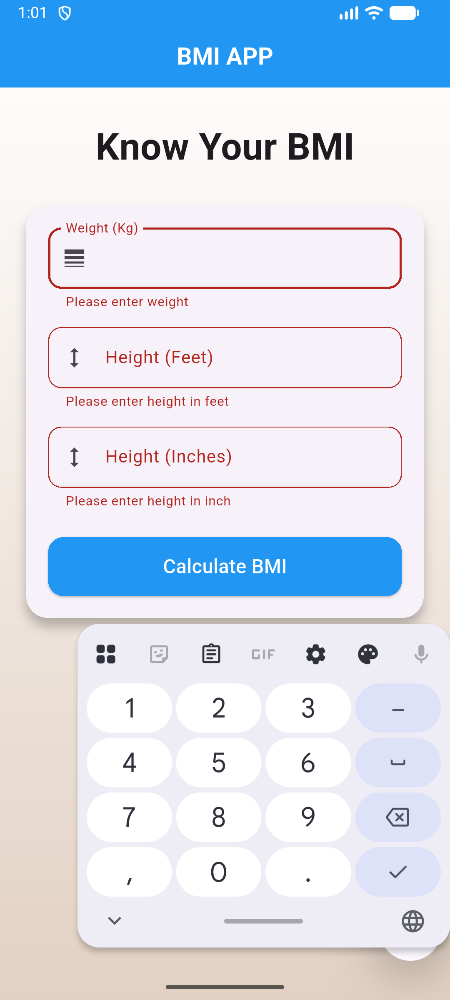

# Flutter BMI Calculator

A modern and clean BMI Calculator app built using Flutter.  
This app allows users to calculate their Body Mass Index (BMI), get health suggestions, and view calculation history.

---

## ✨ Features

- Splash Screen
- BMI Calculation
- Weight Gain / Loss Suggestion
- Input Validation
- Result Screen with Dynamic Color
- History Tracking (Saved using SharedPreferences)
- Clear History Option
- Focus Management (Auto field navigation)
- Keyboard Navigation (Next / Done support)
- Clean & Responsive UI

---

## 📱 Screens

- Splash Screen
- Home (Input Form)
- Result Page
- History Section

---

## 🧠 Improvements Added

- Added Name input field
- Added BMI History storage
- Dynamic Result Background Color (Healthy / Overweight / Underweight)
- Saved History with Date & Time
- Safe async handling using `mounted`
- FocusNode management for better UX
- Keyboard "Done" to auto calculate
- Clean code refactoring (Separated History Section method)

---

## 🛠 Tech Stack

- Flutter
- Dart
- Material Design
- SharedPreferences (Local Storage)

---

## 📸 Screenshots

  
  
  
  
  

---

## 🚀 Future Improvements

- Swipe to delete history
- BMI Graph / Chart
- BLoC Architecture Version
- Hive Database Integration
- Dark Mode Support

---

## 👨‍💻 Author

**Mukesh Mishra**  
Flutter & Frontend Developer