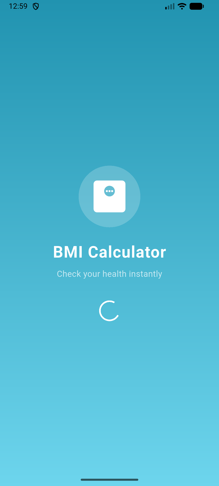
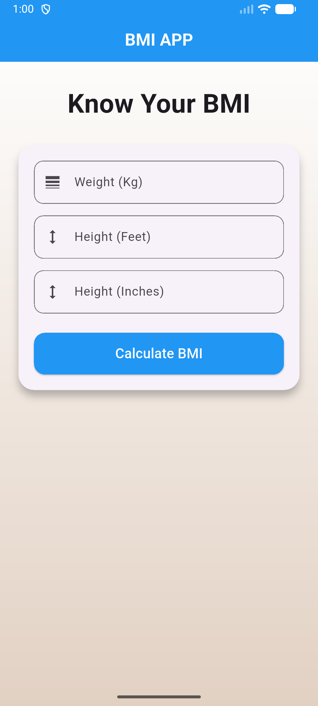
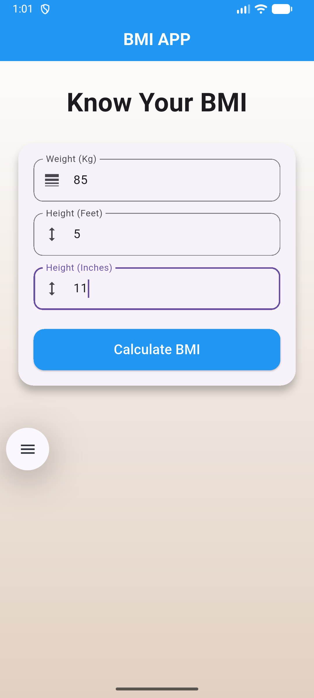
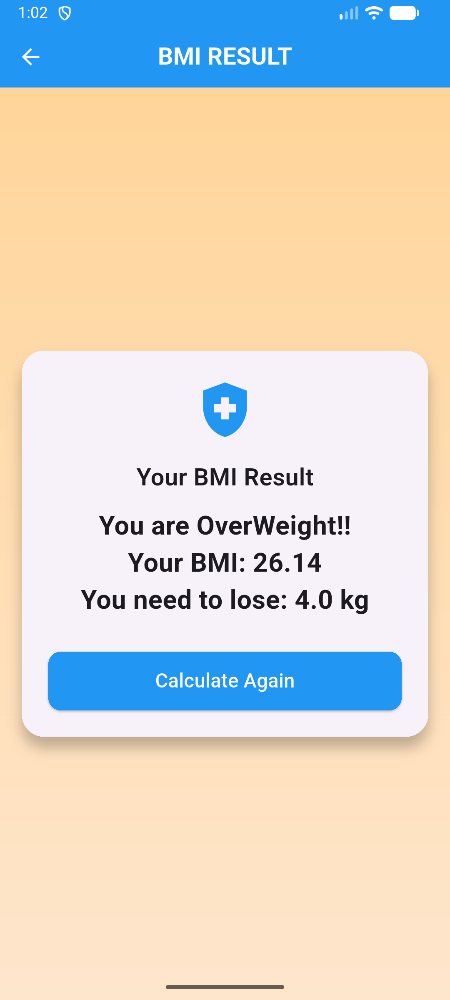

# Flutter BMI Calculator

A clean and simple BMI Calculator app built using Flutter.

## Features
- Splash Screen
- BMI Calculation
- Weight gain / loss suggestion
- Input validation
- Result screen
- Clean UI

## Tech Stack
- Flutter
- Dart
- Material Design

## Screens
- Splash Screen
- Home (Input)
- Result Page

## Screenshots

  
  
 
 
  

## Author
Mukesh Mishra
